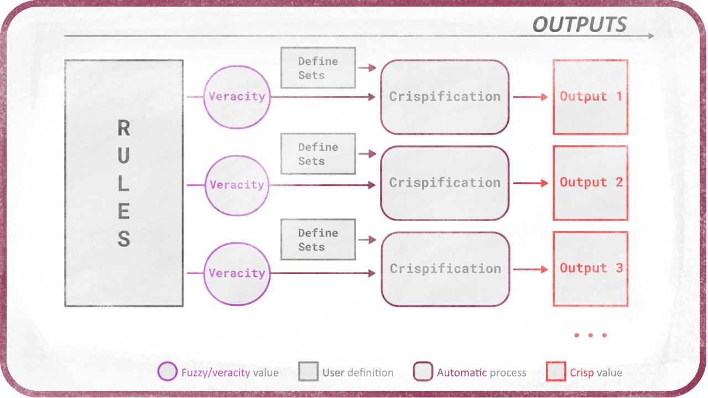

# Crispification

When the rules have been applied and have output some *fuzzy* value, the last step is to get back some *crisp* values to use in the system.

Intuitively, one could think that it's just a matter of getting the average of all the results of all the rules, depending on the veracities of each statement.

But depending on the shape of the sets, there can be several values with the same veracity.

In this case, the *centroid* algorithm is the most used, which consists in getting all possible values from the set for the given veracity of each statement, and getting the mean of these values.

Then all the single values resulting from each statement can be averaged, weighted by their veracity.

Variations can be made on this algorithm, to keep only the higher values or discard them for example, which would either raise or lower a bit the final result, or by returning a range instead of a single value which the system can then use as best fits.

Other algorithms could be implemented for crispification, for example one could also get a random or pseudo-random value from all possible values.
