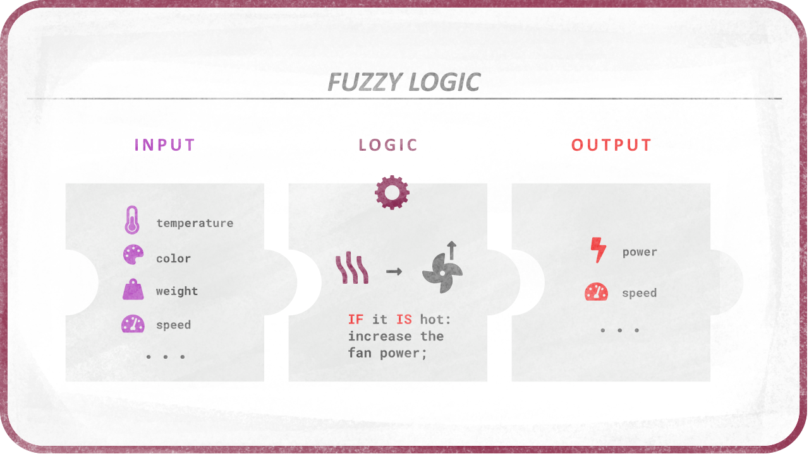

# Fuzzy Logic

- [Introduction](#introduction-to-fuzzy-logic)
  - [Advantages](Advantages.md)
    - [Principle](Advantages.md#principle)
- [Fuzzification](Fuzzification.md)
  - [Sets](Fuzzification.md#sets)
  - [Operators: IS and IS NOT](Fuzzification.md#operators-is-and-is-not)
  - [Shapes](Shapes.md)
    - [Common shapes and membership functions](Shapes.md#common-shapes-and-membership-functions)
    - [Combining shapes](Shapes.md#combining-shapes)
- [Rules and logic operators](Rules.md)
  - [Operators Implementation](Rules.md#implementation)
  - [Quantifiers](Quantifiers.md)
    - [Condition quantifiers](Quantifiers.md#condition-quantifiers)
    - [A Game of words](Quantifiers.md#a-game-of-words)
    - [Linguistic](Quantifiers.md#linguistic)
    - [Newspeak](Quantifiers.md#newlinguistic---orwellian-newspeak)
    - [Symbolic](Quantifiers.md#symbolic)
- [Crispification](Crispification.md)
- Examples
    - JavaScript: [Color: Redness](Redness.md)
    - JavaScript: [Complex example: HVAC](AirConditioning.md)
- [Existing Libraries](Libraries.md)

## Introduction to Fuzzy Logic

Fuzzy Logic is a way to replace Boolean logic when values may not be *completely* true or false, e.g. a temperature can be hot, but more precisely it can be *just a bit* hot or *very* hot.

Using Fuzzy Logic is a way to test the veracity of a statement, and get a nuanced result, which can then be used to set nuanced values according to the truthness, the veracity, obtained from the statement.

For example, if one wants to adjust the power of a fan, one needs to check the temperature and adjust the fan accordingly.

With boolean logic, the statement `IF the temperature IS hot THEN SET the fan on` will either turn the fan on at full power or completely off, according to a predefined limit value.

With Fuzzy Logic, both the veracity and the result being fuzzy and more nuanced, the same statement will adjust precisely the power of the fan according to the hotness. With a single simple rule like this, it is like a conversion (interpolation) of the temperature value into a power value.



But like Boolean logic, Fuzzy Logic becomes very interesting when combining veracity and rules. For example, it becomes easy to code a program with these rules:

```text
IF the temperature IS hot THEN SET the fan on and SET the heater off
IF the temperature IS warm THEN SET the fan off and SET the heater off
IF the temperature IS cold THEN SET the fan off and SET the heater on
```

And if you combine other conditions and quantifiers, you can design quite a complex system:

```text
IF temperature IS hot AND humidity is high THEN SET fan top speed
IF temperature IS hot AND humidity is VERY low THEN SET fan moderate speed
etc.
```

This logic can be used (and *is* used) in a lot of different domains and situation. Think about all kind of controls, auto-pilots, AI, animation...
