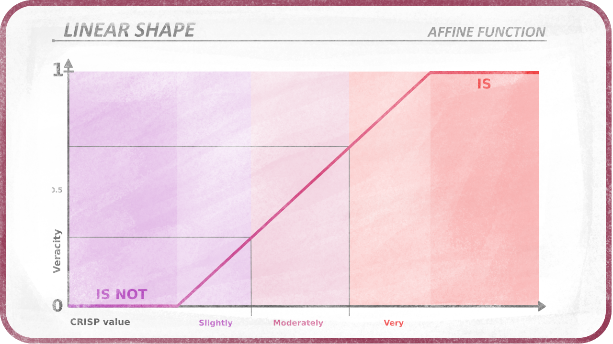
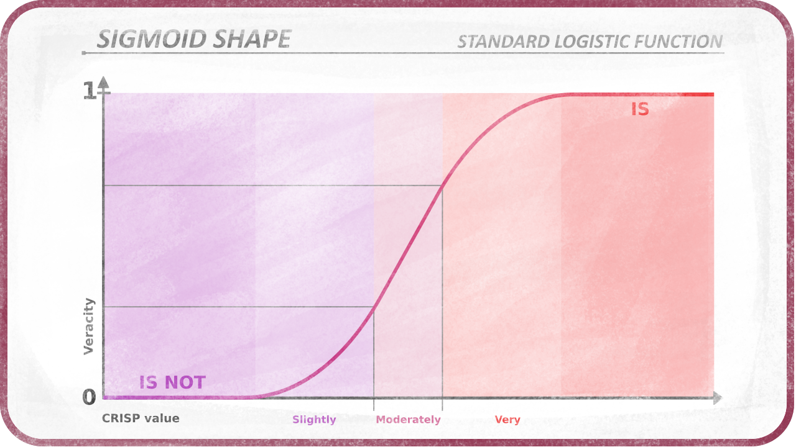
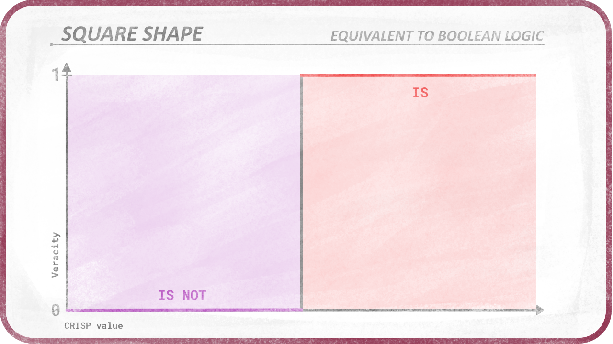
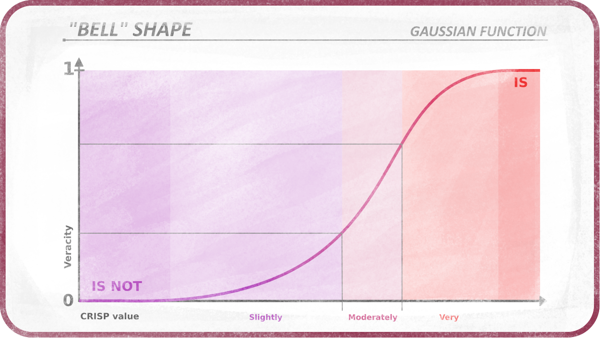
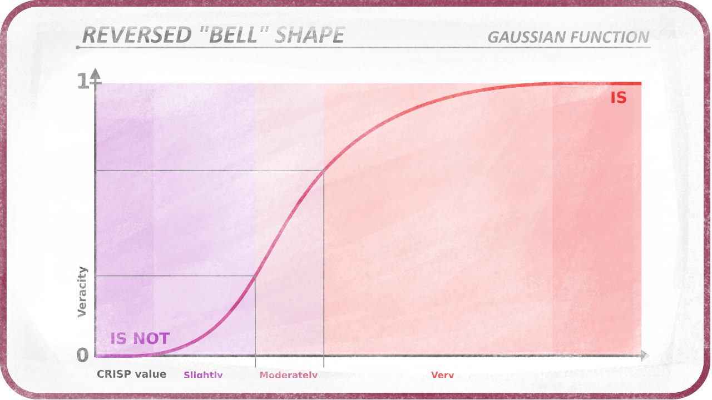
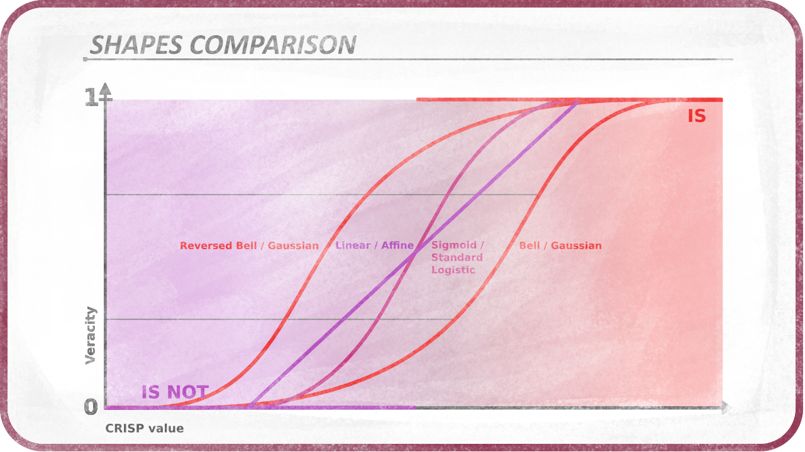
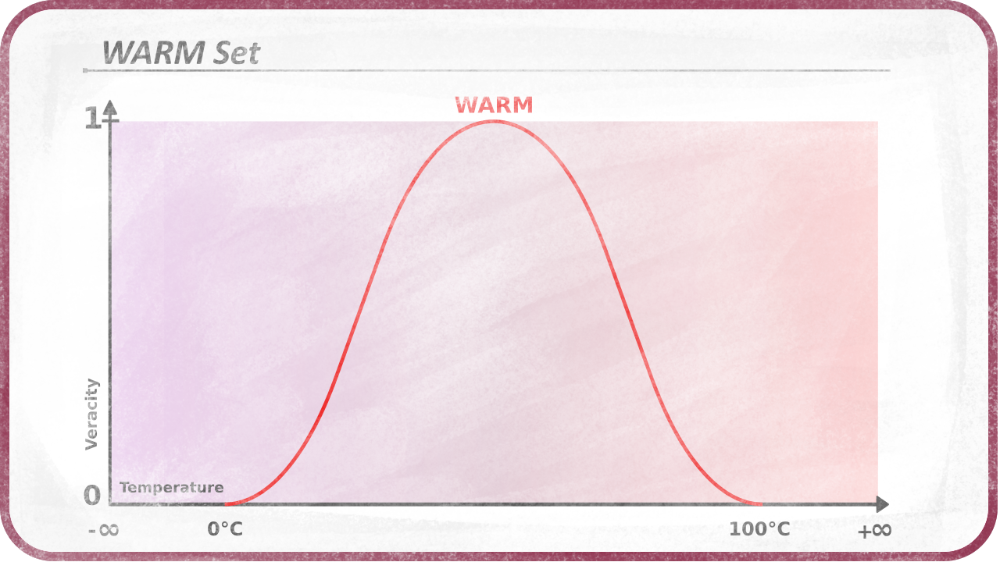
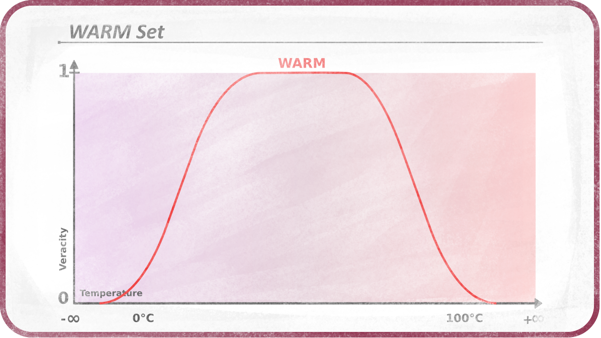
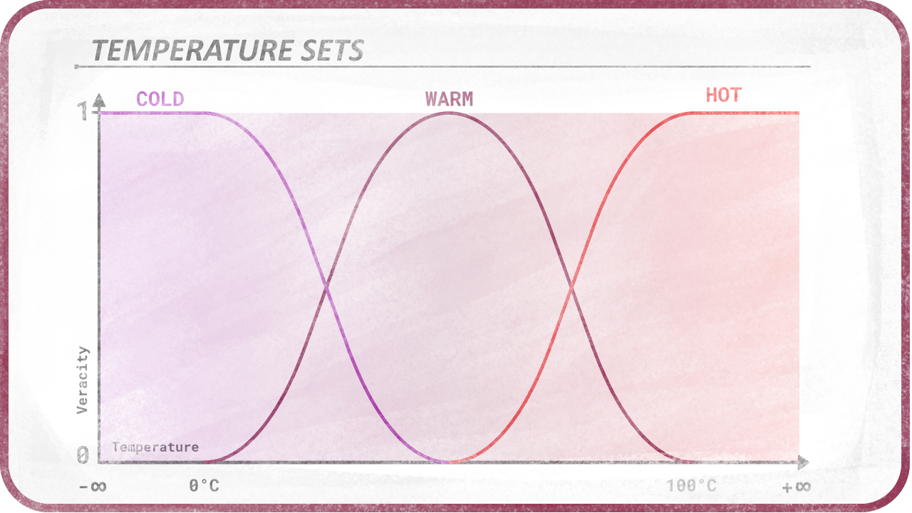

# Shapes

[TOC]

Now comes the question of *how* does the veracity transition to *"is not in the set"* (0 or false) to *"is in the set"* (1 or true). The most intuitive is that the transition may be linear, i.e. if a set starts at 0 up to 100, the *crisp* value `50` has a veracity of `0.5` and the crisp value `25`  has a veracity of `0.25`.

This set can be represented by a graph where the values are on the horizontal axis and the veracity is on the vertical axis:

Its shape is linear.

It may be interesting to change the shape of the set, to better reflect what the value represents or what it may be used for.

The shape of the set is given by a membership function. It is a function which takes any given value as variable and which result is the veracity of the inclusion of this value in the set, a.k.a its membership. Membership functions can be any function and generate any kind of shape.

## Common shapes and membership functions

  
"IF value > limit THEN veracity IS 1 ELSE veracity is 0"

  
A simple linear function

  
An S-shaped function, which can be the [*standard logistic function*](https://en.wikipedia.org/wiki/Logistic_function)

  
An bell-shaped function, which is the [*gaussian function*](https://en.wikipedia.org/wiki/Gaussian_function)

  
The bell-shaped function may be useful in its reversed form too.

It is also possible to use a [*Bézier curve*](https://en.wikipedia.org/wiki/B%C3%A9zier_curve) to define a parametric shape, or any other function.

Note that a given *crisp* value can be *above* or *below* a set. For example, 0⁰C is not in the set "comfortable", neither is 50⁰C. In this case, the "comfortable" set can have a shape with two sides:

It is also possible to have a plateau where all values are equally (and indifferentially) in the set, or true.

## Combining shapes

Combining several shapes, it is possible to represent any *crisp* value from -inifinity to +infinity.

This reasoning is for 1-dimensionnal sets, but we could imagine 2 or 3-D sets, which would be represented by a fuzzy area or a fuzzy volume, allowing to quantify 2-D or 3-D values or vectors.

And it is also possible to build n-dimension sets to test n-dimension values (e.g. an RGB color with Alpha which is 4D) but the more dimensions, the more complex the functions for defining the shapes are.
